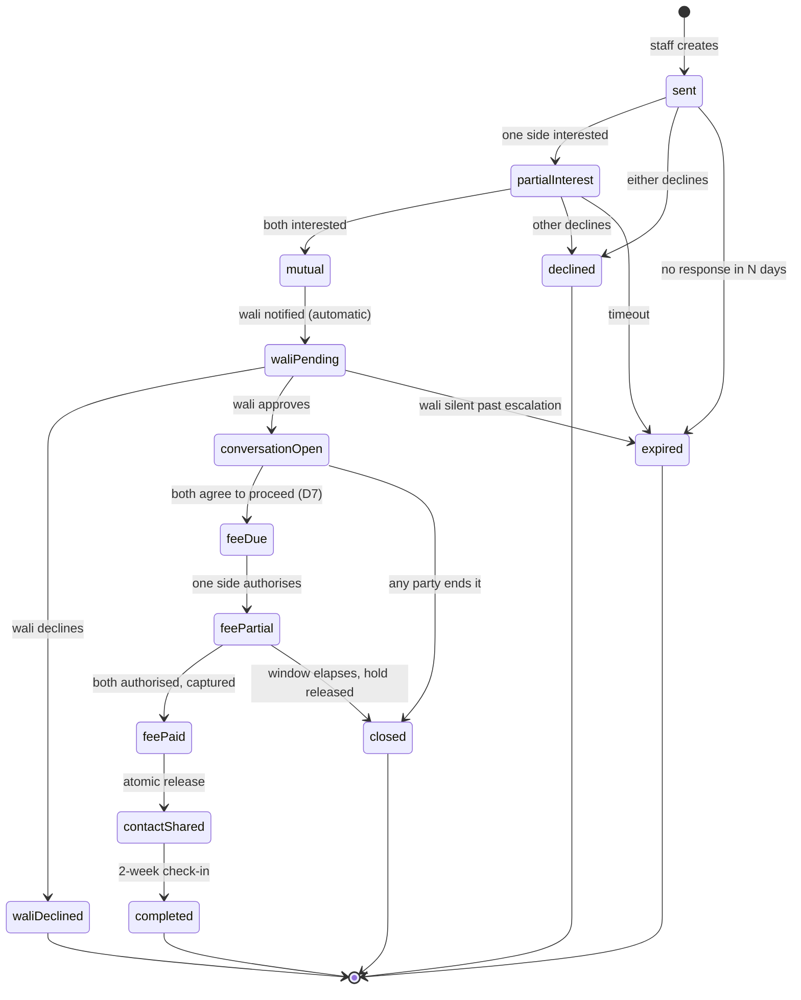

# NikahCanada — Application Development Plan

**Status:** draft for review · **Owner:** _unassigned_ · **Last updated:** 2026-08-06

This is the build plan for the NikahCanada product — the member app, the wali
portal and the staff console — on MongoDB. The marketing site at `/` and the
annotated mock-ups at `/how-it-works` already exist in this repo and are the
reference for what the product does; this document is how it gets built for real.

> **Nothing in this document invents a business fact.** The matchmaking fee
> amount, the monthly introduction allowance, SLA targets and refund windows are
> all marked `⚠ NEEDS INPUT`. The `$149` on the mock-up fee screen is a
> placeholder, flagged in `src/content/howItWorks.ts`, and must not reach
> production.

---

## Contents

1. [How to use this document](#1-how-to-use-this-document)
2. [What we are building](#2-what-we-are-building)
3. [Decisions required before building](#3-decisions-required-before-building)
4. [Architecture](#4-architecture)
5. [Data model](#5-data-model-mongodb)
6. [The introduction lifecycle](#6-the-introduction-lifecycle)
7. [Subsystems](#7-subsystems)
8. [Screen inventory](#8-screen-inventory)
9. [Delivery phases](#9-delivery-phases)
10. [Non-functional requirements](#10-non-functional-requirements)
11. [Testing and verification](#11-testing-and-verification)
12. [Operations](#12-operations)
13. [Legal and content deliverables](#13-legal-and-content-deliverables)
14. [Risk register](#14-risk-register)
15. [Open questions log](#15-open-questions-log)

---

## 1. How to use this document

Sections 2–8 are the specification: they should be stable once the decisions in
§3 are made. Section 9 is the schedule and will churn. Sections 10–14 are
standing obligations that apply to every phase, not a final cleanup pass.

Every unresolved item is tagged `⚠ NEEDS INPUT` (business decision needed) or
`⚠ NEEDS DESIGN` (product/UX decision needed) and is collected in §15. Do not
let one of these get silently resolved by whoever writes the code first — the
answers change the data model.

---

## 2. What we are building

### 2.1 The service, as published

NikahCanada is a human-run matrimonial service, not a dating app. The published
process is six steps:

| # | Step | What it means for the software |
| --- | --- | --- |
| 01 | Registration | Free. No photograph. Gender asked first because it determines whether a wali is required. |
| 02 | Searching for matches | **Members browse, and staff also refer** (decided 2026-08-08 — see D1). Member-facing search and a staff search console. |
| 03 | Profile security check | Identity and references verified before a profile enters the pool. Now a hard gate: nothing unverified is browsable. |
| 04 | Matchmaking | Connection request → acceptance → wali approval → conversation. |
| 05 | Matchmaking fee | Charged once, to both sides, before contact details move. |
| 06 | Contact information | Real names and details released last, to both members and the wali simultaneously. |

### 2.2 What the product deliberately does not do

These are constraints on the build, not features postponed. They come from
`src/content/howItWorks.ts` and are published on the marketing site:

- **No public profiles.** The pool is closed: visible to verified members only,
  never to the open web, never indexed, never shown to a non-member.
- No swiping, no feed, no stack. Asking to talk spends a connection.
- No private messaging — every thread includes the guardian.
- No photographs on profiles. Exchanged privately, on consent, or not at all.
- No open-ended chatting — conversations move toward a family meeting or close.
- No selling or sharing of profile data.

If a proposed feature violates one of these, it is a change to the published
promise and needs sign-off, not a ticket.

> **Changed 2026-08-08.** The first two bullets used to read "no directory, no
> search, no filters for members" and "introductions are read one at a time".
> Browsing was adopted (D1), and the marketing copy was rewritten to match —
> `home.ts` and `howItWorks.ts` carry the note. The surviving confidentiality
> claims were narrowed deliberately so that each one stays literally true.

### 2.3 Actors

| Actor | Description | Has an account |
| --- | --- | --- |
| **Member (sister)** | A woman seeking marriage. Must have a confirmed wali before her profile enters the pool. | Yes |
| **Member (brother)** | A man seeking marriage. Provides a reference rather than a wali. | Yes |
| **Wali** | The woman's guardian. A first-class user with his own portal: approves introductions, reads every conversation, can end one at any time. | Yes |
| **Matchmaker (staff)** | Searches the pool, creates introductions, runs the intake phone call. | Yes |
| **Verifier (staff)** | Reviews identity documents and contacts references. May be the same person as the matchmaker; separate permission. | Yes |
| **Admin** | Staff management, fee configuration, refunds, audit access. | Yes |

A single person can hold more than one role — a brother who is also his sister's
wali is a realistic and common case. The data model must allow it (see §5.1).

### 2.4 What the mock-ups do not cover

The ten screens in `src/components/app/screens/` describe the member and wali
experience. They do not describe the following, all of which are required:

- **The entire staff console.** The business model is "a person handles every
  stage." Realistically **35–45% of the total build.** This is the single most
  commonly underestimated part of this plan.
- **The intake phone call.** The site promises "we will speak with you by phone
  before any matching begins." That is a scheduled, logged pipeline step.
- **Identity verification mechanics** — document capture, review, retention.
- **The brother's reference.** `ContactShared` reveals "his wali or reference,"
  but no onboarding screen collects it.
- **Wali verification.** He holds veto power over a woman's marriage prospects
  and can read her private correspondence. He is currently taken on trust.
- **Failure paths** — wali never confirms, wali declines, wali goes silent
  mid-conversation, wali needs replacing, member pauses or withdraws.
- **Photo exchange** — promised in copy, no screen exists.
- **Conversation closing and re-matching.**
- **Reporting, blocking and safety escalation.**
- **Payments, refunds, receipts and tax.**

---

## 3. Decisions required before building

### 3.1 Blocking — these change the data model or the architecture

#### D1. Curated queue or open browsing? `⚠ NEEDS INPUT`

The live site says profiles are stored offline, are not publicly browsable and
are referred by a human. The client has separately described an app where
members "see other profiles and match." The mock-ups resolve this as a **curated
queue with a monthly cap, no search, initials instead of names.**

These are different products:

| | Curated queue (as mocked) | Open browsing |
| --- | --- | --- |
| Search/filter UI | Staff console only | Member app — a major subsystem |
| Profile visibility | One-to-one, on staff action | Pool-wide to eligible members |
| Marketing copy | Consistent | **Contradicted** — "your profile is not public, and never will be" becomes false |
| Wali model | Approves each introduction | Approves… what? Needs redesign |
| Staff load | High — every match is manual | Low |
| Data model | `introductions` is the core document | `profiles` becomes the core read surface |

~~**Recommendation:** build the curated queue.~~

#### ✅ DECIDED 2026-08-08 — open browsing, with a connection economy

Members of both genders browse a closed pool of verified profiles. Looking is
free. **Asking to talk spends a connection** from a per-member balance. On
acceptance the flow rejoins the published process unchanged: wali approval, then
a conversation he reads in full, then the fee, then contact details last.

Staff referral continues alongside it — browsing was *added*, not substituted.

**Done in consequence:** the marketing copy was rewritten (`home.ts`,
`howItWorks.ts`) and the app mock-ups relabelled. §2.1 and §2.2 above updated.

**Still open, and blocking the schemas:**

| | Question |
| --- | --- |
| D1a | Where do connections come from — a free grant, purchased packs, or both? If sold, this becomes the revenue model and supersedes D3/D4. |
| D1b | Spent on send, on acceptance, or reserved on send and consumed on acceptance? *Recommendation: reserve, consume on acceptance, refund on decline or expiry.* |
| D1c | Do both genders spend to initiate, or only brothers? |
| D1d | Is there an **inbound cap** — a limit on pending requests a member can hold, after which they stop appearing in browse? *Recommendation: yes.* Without it the sender budget protects the platform and nothing protects the receiver, whose wali also inherits every accepted thread. |
| D1e | Expiry window on an unanswered request, and whether a decline is disclosed to the sender or left ambiguous. |
| D1f | Can a member browse before their own verification completes? *Recommendation: no — a browsable unverified pool is a scam surface.* |
| D1g | **Does the wali still approve before a conversation opens, or only observe it?** The client described him as reading every message; the published process has him approving first. Kept as approver pending an answer. *Recommendation: keep the gate, and let each wali opt into standing approval.* |

**Knock-on, not yet reflected below:** §5.5 `introductions` becomes a connection
request, §6's state machine loses the staff-created and mutual-interest steps,
§7.4 gains connection purchases if D1a says so, and Phase 5 changes from a staff
search tool to a member-facing browse subsystem. §9.1's "operate manually in 12
weeks" weakens — a matchmaker works with fifty profiles; browsing does not.

**Needs sign-off.** This reverses a promise published on nikahcanada.com, and
"no browsing" reads as a scholarly position rather than a marketing one — so it
belongs in front of Mufti Faisal al-Mahmudi as well as the client (§3.4).

#### D2. Web app, or native mobile? `⚠ NEEDS INPUT`

The mock-ups are phone-shaped, which reads as "native app," but nothing requires
it.

**Recommendation: responsive web app, installable as a PWA.** One codebase,
instant deploys, no store review, and it reuses the design system already built
in this repo. Add a Capacitor wrapper later if store presence is wanted.

The material risk with native-first is the **Apple App Store**. Matrimonial and
dating apps get extra scrutiny (Guideline 1.2, 4.7), and there is a genuine
question whether the matchmaking fee must go through In-App Purchase at 30%.
Human matchmaking with real-world contact exchange should qualify as a
"real-world service" exempt under 3.1.3(e), but Apple has rejected comparable
apps. **Do not build a revenue model that depends on winning that argument.**

#### D3. Is the fee charged once ever, or once per match? `⚠ NEEDS INPUT`

The site says the fee is "charged once, to both sides." Once per *introduction
that reaches contact exchange*, or once per member for life? This is the entire
revenue model and it changes the `payments` schema and the pricing copy.

#### D4. What is the fee, in CAD? `⚠ NEEDS INPUT`

No amount is published anywhere. Needed for the fee screen, the marketing
pricing section, Stripe configuration and tax setup.

#### D5. Where does the data live? `⚠ NEEDS INPUT`

**Recommendation: MongoDB Atlas in a Canadian region** (`ca-central-1`), with
application compute in Canada as well. Quebec's Law 25 requires a privacy impact
assessment before personal information leaves the province, and this data is
sensitive (religious practice, marital history, identity documents). Keeping it
in Canada removes an entire class of legal work. See §10.2.

### 3.2 Blocking — product design

| # | Question | Why it matters |
| --- | --- | --- |
| D6 | Can the wali **write** in a conversation, or only read? `⚠ NEEDS DESIGN` | The banner says he "can read every message"; the copy says he is "a participant rather than a bystander." Different UI and different `participants.canWrite`. |
| D7 | Who triggers the fee stage? `⚠ NEEDS DESIGN` | "At the point where a conversation has become serious" is not a state transition. Either a member requests it and the other confirms, or staff advance it. |
| D8 | Can a member hold **multiple concurrent conversations**? | The wali portal shows "Open conversations" plural, implying yes. There is a legitimate Islamic-practice argument for one at a time. Needs the scholar's view. |
| D9 | Does declining an introduction consume monthly allowance? | Mock-up shows "3 of 5 remaining." Presumably counts introductions *received*. Confirm. |
| D10 | Is the wali identity-verified? | Recommendation: yes. He has veto power and read access to private correspondence. |
| D11 | On wali replacement, does the new wali see past conversations? | Ethically and legally sensitive. Recommendation: no — new wali starts fresh, history remains available to staff only. |

### 3.3 Non-blocking — decide before the relevant phase

| # | Question | Needed by |
| --- | --- | --- |
| D12 | Monthly allowance limit, and whether it resets on a calendar month or rolling 30 days | Phase 5 |
| D13 | Introduction expiry window with no response | Phase 5 |
| D14 | Wali invitation reminder cadence, and escalation when he never confirms | Phase 3 |
| D15 | Refund window when only one side pays | Phase 8 |
| D16 | Verification SLA and intake-call scheduling method | Phase 4 |
| D17 | Retention period for identity documents post-decision | Phase 4 |
| D18 | Does the 2-week post-match check-in happen in-app or by phone? | Phase 9 |

### 3.4 Standing obligation

The matchmaking process was developed "through full consultation with Mufti
Faisal al-Mahmudi of Darul Iftaa Canada." The **software implementation should
get the same review** before launch — specifically the wali's powers, the
conversation rules, concurrent conversations (D8) and the photo exchange consent
model. Schedule this in Phase 10, not the week before launch.

---

## 4. Architecture

### 4.1 Stack

| Layer | Choice | Rationale |
| --- | --- | --- |
| Framework | **Next.js 15, App Router** | Already in the repo. Server Components keep member data off the client by default, which suits a privacy-first product. |
| Language | **TypeScript, strict** | Already configured. |
| UI | **React 19 + Tailwind v4** | Already in the repo. The design system in `src/components/app/kit.tsx` carries over directly (see §4.4). |
| Database | **MongoDB Atlas M10+** | Required by the brief. M10 is the floor: replica set (transactions), private endpoint, Atlas Search and Queryable Encryption all need it. |
| Data access | **Native `mongodb` driver + Zod** | See §4.2. |
| Auth | **Auth.js v5** — credentials + email magic link | Magic links carry the wali invitation flow cleanly. |
| Payments | **Stripe** (CAD, Stripe Tax for GST/QST) | |
| Object storage | **S3-compatible, Canadian region, private** | Identity documents and consented photos. Never public; short-lived signed URLs only. |
| Email | **Postmark or Resend** | Wali invitations are load-bearing — deliverability matters more than price. |
| SMS | **Twilio** | Walis skew older and may not check email. |
| i18n | **next-intl** | `fr-CA` is a legal requirement, not a nicety (§10.3). |
| Monitoring | **Sentry** with PII scrubbing + structured logs | |
| Testing | **Vitest + Playwright** | Playwright is already a dev dependency and the repo has a checker culture worth extending. |

### 4.2 Why the native driver rather than Mongoose

**Recommendation: native `mongodb` driver with Zod schemas and a thin repository
layer.**

- **Queryable Encryption** is configured at the driver/client level. Mongoose
  adds friction here, and this app stores identity data, legal names and phone
  numbers that should be encrypted at field level.
- **Multi-document transactions** (the fee flow, contact release) are cleaner
  with explicit driver sessions.
- **Zod schemas are the single source of truth** — same schema validates the
  HTTP request body and the document shape, and infers the TypeScript type. With
  an ODM you maintain two definitions that drift.

**Honest trade-off:** you write your own repository layer and lose `populate`,
virtuals and middleware. If the team is more productive in Mongoose, that is a
legitimate choice — but budget extra time for the encryption work and accept
that schema drift becomes a live risk.

**Serverless caveat:** cache the `MongoClient` on `globalThis` across
invocations. Creating a client per request will exhaust the connection pool.

### 4.3 Repository layout

Keep one Next application. The marketing site and the product share a design
system, a deployment and a domain; splitting them early costs more than it saves.

```
src/
  app/
    (marketing)/            # existing public site — unchanged
      page.tsx
      how-it-works/
    (app)/                  # member + wali product, auth-gated
      layout.tsx            # session provider, app chrome
      onboarding/
      introductions/
      conversations/
      wali/
      settings/
    (admin)/                # staff console, separately gated
      layout.tsx
    api/
  components/
    bridely/                # marketing sections (existing)
    app/                    # the real design system — grown from kit.tsx
    admin/
  lib/
    db/                     # client, collections, indexes, migrations
    domain/                 # Zod schemas + state machines — no I/O
    repositories/           # the only place that touches the driver
    services/               # use cases: introduce, approve, chargeFee…
    auth/
    notifications/
    payments/
    storage/
    audit/
  content/                  # copy, becoming i18n message catalogues
messages/                   # en-CA.json, fr-CA.json
docs/
scripts/                    # existing Playwright checkers
```

**Split the admin console into its own deployment when** staff exceed a handful
of people, or when you want IP allowlisting and a separate auth domain. Design
for it now (own route group, own layout, own middleware) so the split is cheap
later.

**Keep `lib/domain` free of I/O.** State machines and validation should be
unit-testable without a database. This is what makes §6 verifiable.

### 4.4 What the existing mock-ups contribute

`src/components/app/kit.tsx` already contains `AppBar`, `Progress`, `Field`,
`Segmented`, `Chip`, `Btn`, `Initials`, `WaliBanner`, `BottomNav`, `Lock` and
`Check`, all on the live palette. **These become the real design system** —
`Field` and `Btn` grow interactive props, the rest are close to production-ready.
That is a genuine head start.

The ten screen components themselves are static marketing artefacts. They stay
where they are, rendered inside `/how-it-works`, and are **rebuilt** as stateful
components in the product. Do not try to make one component serve both — the
marketing page needs a frozen, always-perfect screenshot, and the product needs
loading, empty and error states.

### 4.5 Environments

| Environment | Database | Purpose |
| --- | --- | --- |
| Local | Docker `mongo` replica set, or `mongodb-memory-server` for tests | Replica set required — transactions do not work standalone. |
| Preview | Shared Atlas dev cluster, seeded with obviously fake data | Per-PR deploys. |
| Staging | Own Atlas cluster, production-shaped | Rehearse migrations and restores here. |
| Production | Own Atlas cluster, Canadian region, private endpoint, backups on | |

Never copy production data downward. Seed instead; real member data must not
leave production.

---

## 5. Data model (MongoDB)

Conventions: `_id` is `ObjectId`. All documents carry `createdAt` / `updatedAt`.
Fields marked 🔒 are encrypted with Queryable Encryption. Fields marked 🔎 are
encrypted but queryable (equality or range).

### 5.1 `users`

The account. Roles are an array, not a type — a brother who is also his sister's
wali holds both.

```js
{
  _id, email,                      // unique, lowercased
  emailVerifiedAt,
  passwordHash,                    // argon2id
  roles: ["member"|"wali"|"staff"|"verifier"|"admin"],
  status: "active"|"suspended"|"closed",
  locale: "en-CA"|"fr-CA",
  legalName: { first, last },      // 🔎 released only at step 06
  phone: { e164, verifiedAt },     // 🔎
  dateOfBirth,                     // 🔒 exact; see profiles.basics.birthYear for matching
  mfa: { enabled, secret },        // 🔒 mandatory for staff/admin
  lastLoginAt, failedLoginCount, lockedUntil,
  closedAt, closureReason
}
```

**Indexes:** `{email:1}` unique · `{roles:1, status:1}` · `{"phone.e164":1}`

> **Design note.** Exact date of birth is encrypted and only staff see it during
> verification. Matching uses `birthYear` on the profile, stored in the clear.
> This keeps age-range queries fast and simple while leaking far less than a full
> DOB.

### 5.2 `profiles`

One per member. Separate from `users` because the lifecycles differ — an account
persists, a profile goes draft → live → paused → withdrawn.

```js
{
  _id, userId,                     // unique
  gender: "brother"|"sister",      // set at signup, immutable
  status: "draft"|"pendingCall"|"pendingReview"|"verifying"
        | "live"|"paused"|"matched"|"withdrawn"|"rejected",
  completeness: { step, of, percent },
  initials: "F.A",                 // derived; the only identity shown pre-reveal

  basics:     { birthYear, city, province, country, citizenship,
                yearsInCanada, willingToRelocate },
  deen:       { salah, dress, beard, madhhab, quran, revert, practisingSince },
  background: { ethnicity, languages: [], maritalStatus, hasChildren,
                childrenDetail },                              // 🔒 childrenDetail
  education:  { level, field, institution },
  work:       { occupation, employmentStatus },
  family:     { bornIn, parentsFrom, detail },                 // 🔒 detail
  lookingFor: { ageMin, ageMax, provinces: [], maritalStatus: [],
                madhhab: [], mustRelocate, freeText },         // 🔒 freeText
  freeText:   { aboutMe, anythingElse },                       // 🔒

  reference:  { name, relationship, organisation, phone },     // 🔒 brothers — see §2.4
  allowance:  { periodStart, periodEnd, sent, limit },
  liveAt, pausedAt, withdrawnAt
}
```

**Indexes:**

```
{ userId: 1 }                                          unique
{ status: 1, gender: 1, "basics.birthYear": 1 }        # the matching workhorse
{ status: 1, "basics.province": 1, "basics.city": 1 }
{ status: 1, "deen.madhhab": 1, "deen.salah": 1 }
{ status: 1, "background.maritalStatus": 1 }
{ status: 1, "allowance.periodEnd": 1 }                # monthly reset job
```

> **Use Atlas Search for the staff candidate search.** Matchmakers will combine
> filters arbitrarily — age *and* province *and* madhhab *and* marital status *and*
> free text. You cannot compound-index every permutation. One Atlas Search index
> handles all of them and gives you relevance ranking for free. The B-tree indexes
> above stay for the fixed operational queries.

### 5.3 `guardianships`

The wali link. Has its own lifecycle because a wali can decline, expire, be
revoked or be replaced, and that history matters.

```js
{
  _id, memberUserId, memberProfileId,
  waliUserId,                      // null until he accepts and creates an account
  invited: { name, relationship, email, phone,   // 🔎 email, phone
             invitedAt, token, expiresAt, remindersSent },
  status: "invited"|"confirmed"|"declined"|"expired"|"revoked"|"replaced",
  confirmedAt, declinedAt, declineReason,
  verification: { state, verifiedAt, method },   // see D10
  replacesGuardianshipId, replacedByGuardianshipId
}
```

**Indexes:** `{memberUserId:1, status:1}` · `{waliUserId:1, status:1}` ·
`{"invited.token":1}` unique sparse · `{status:1, "invited.expiresAt":1}`

Enforce in the service layer: **at most one `confirmed` guardianship per member
at a time.** A sister's profile cannot reach `live` without one.

### 5.4 `verifications`

Step 03, plus wali verification and the intake phone call.

```js
{
  _id,
  subject: { type: "member"|"wali", userId },
  kind: "identity"|"reference"|"intakeCall",
  documents: [{ storageKey, docType, uploadedAt, deletedAt }],  // delete after decision
  reference: { name, relationship, organisation, phone,          // 🔒
               contactedAt, outcome, notes },                    // 🔒 notes
  call: { scheduledFor, completedAt, staffUserId, notes },        // 🔒 notes
  decision: "pending"|"approved"|"rejected"|"moreInfoNeeded",
  decidedBy, decidedAt, reason
}
```

**Indexes:** `{"subject.userId":1, kind:1}` · `{decision:1, createdAt:1}` (staff
queue, oldest first) · `{decision:1, "call.scheduledFor":1}`

**Identity documents are deleted once a decision is recorded** (D17). Retain the
decision, the document type and a hash — never the image. This shrinks the breach
blast radius enormously for very little operational cost.

### 5.5 `introductions`

The core document. One per curated match.

```js
{
  _id,
  pairKey,                         // "<sisterProfileId>:<brotherProfileId>", unique
  sisterProfileId, brotherProfileId,
  sisterUserId, brotherUserId,
  guardianshipId,                  // her confirmed wali at time of introduction
  createdBy, createdAt, rationale, // 🔒 rationale — staff's reasoning
  state,                           // see §6
  responses: {
    sister:  { decision: "pending"|"interested"|"declined", at, reason },
    brother: { decision: "pending"|"interested"|"declined", at, reason }
  },
  waliDecision: { decision: "pending"|"approved"|"declined", at, reason },
  conversationId,
  fee: { state, sisterPaymentId, brotherPaymentId, dueAt },
  contactSharedAt,
  expiresAt,
  closedAt, closedBy, closeReason,
  outcome: null|"nikah"|"notProceeding"|"unresponsive",
  timeline: [{ event, at, actorUserId, meta }]   // drives the MutualInterest screen
}
```

**Indexes:**

```
{ pairKey: 1 }                       unique   # never introduce the same pair twice
{ sisterProfileId: 1, state: 1 }
{ brotherProfileId: 1, state: 1 }
{ state: 1, createdAt: 1 }                     # staff pipeline board
{ state: 1, expiresAt: 1 }                     # expiry job
{ guardianshipId: 1, state: 1 }                # wali portal
```

`timeline` is embedded rather than a separate collection: it is bounded (tens of
entries), always read with its parent, and never queried across documents. The
`auditLog` (§5.10) is the cross-cutting record; `timeline` is the user-facing one.

### 5.6 `conversations`

```js
{
  _id, introductionId,             // unique
  participants: [{ userId, role: "member"|"wali", canWrite }],   // see D6
  state: "open"|"closedByWali"|"closedByMember"|"closedByStaff"|"completed",
  openedAt, lastMessageAt, messageCount,
  closedAt, closedBy, closeReason
}
```

**Indexes:** `{introductionId:1}` unique ·
`{"participants.userId":1, state:1, lastMessageAt:-1}`

### 5.7 `messages`

Immutable by product rule: "Messages cannot be edited or deleted once sent, by
anyone."

```js
{
  _id, conversationId,
  senderUserId, senderRole: "member"|"wali"|"system",
  kind: "text"|"system"|"attachment",
  body,                            // 🔒
  createdAt,
  readBy: [{ userId, at }],
  redaction: { at, by, reason }    // staff-only legal removal; shell remains visible
}
```

**Indexes:** `{conversationId:1, createdAt:1}` · `{conversationId:1, _id:-1}`
(pagination)

Enforce immutability in **two** places: reject update/delete in the repository
layer, and add a MongoDB schema validator. A product promise this explicit should
not rest on one line of application code.

`redaction` exists only for a legal removal order. It blanks the body, leaves the
message visible as redacted, and writes an audit entry. It is not an "unsend."

### 5.8 `payments`

```js
{
  _id, introductionId, payerUserId,
  amount, currency: "CAD",
  tax: { gst, qst, total },
  stripePaymentIntentId,           // unique
  state: "requiresPayment"|"authorized"|"captured"|"refunded"|"failed"|"expired",
  authorizedAt, capturedAt, refundedAt,
  refund: { stripeRefundId, reason, at },
  receiptUrl
}
```

**Indexes:** `{introductionId:1, payerUserId:1}` unique ·
`{stripePaymentIntentId:1}` unique · `{state:1, authorizedAt:1}` (expiry sweep)

**Both-sides-pay mechanics.** Use **manual capture**: authorise each side, capture
both only when the second authorisation lands. If the second never arrives, release
the first — nothing is charged and there is no refund to explain. Stripe
authorisation holds expire after **7 days**, so the fee window must be shorter than
that, with capture-then-refund as the fallback. This is materially kinder than
charging and refunding, and it matches the published promise exactly.

### 5.9 `photoExchanges`

```js
{
  _id, introductionId,
  requestedBy, requestedAt,
  consents: [{ userId, role, decision, at }],       // both members + the wali
  photos: [{ ownerUserId, storageKey, uploadedAt, expiresAt }],
  state: "requested"|"consented"|"shared"|"declined"|"expired"
}
```

Photos live in private storage with short-lived signed URLs and a hard expiry.
They are never attached to a profile.

### 5.10 `auditLog`

Append-only. This is both a product feature — the wali portal shows "Every action
is logged with a timestamp" — and a compliance requirement.

```js
{
  _id, at,
  actor: { userId, role, ip, userAgent, impersonatedBy },
  action: "introduction.created" | "wali.approved" | "contact.released" | …,
  subject: { type, id },
  meta: {}
}
```

**Indexes:** `{"subject.type":1, "subject.id":1, at:-1}` ·
`{"actor.userId":1, at:-1}` · `{action:1, at:-1}`

No updates, no deletes, ever. Move old entries to Atlas Online Archive rather than
deleting. `impersonatedBy` is mandatory whenever staff use "view as member" (§7.8).

### 5.11 Supporting collections

| Collection | Purpose | Key indexes |
| --- | --- | --- |
| `notifications` | Queued/sent email, SMS, push, in-app | `{state:1, scheduledFor:1}`, `{dedupeKey:1}` unique sparse |
| `reports` | Safety reports and blocks | `{state:1, createdAt:1}`, `{subjectUserId:1}` |
| `staffNotes` | Matchmaker's private notes 🔒 | `{subjectUserId:1, createdAt:-1}` |
| `outcomes` | 2-week check-in and result | `{introductionId:1}`, `{checkInAt:1}` |
| `sessions` | Auth.js database sessions | `{sessionToken:1}` unique, TTL on `expires` |
| `idempotencyKeys` | Stripe webhook + mutation safety | `{key:1}` unique, TTL |
| `settings` | Fee amount, allowance limit, SLA targets — configurable, not hard-coded | `{key:1}` unique |

### 5.12 Transactions

Multi-document transactions (replica set required) are mandatory for:

1. **Contact release** — flip `introductions.state`, write the reveal event,
   write three notifications, write the audit entry. Partial success here means a
   member sees a name the wali does not, which breaks the central promise.
2. **Fee capture** — capture both payments and advance state together.
3. **Wali approval** — create the conversation, seed the system message, advance
   the introduction.
4. **Guardianship replacement** — revoke the old, confirm the new.

Everything else can be a single-document update. Do not reach for transactions by
default; MongoDB single-document writes are already atomic.

### 5.13 Migrations

MongoDB being schemaless does not mean you can skip migrations — it means nothing
stops you from shipping a broken one. Use `migrate-mongo` with numbered, reversible
scripts committed to the repo, run in CI against staging before production, and
covering index creation as well as document reshaping. Build indexes in the
background on a live cluster.

---

## 6. The introduction lifecycle

This state machine is the heart of the product. Implement it in `lib/domain` as a
pure function — `(state, event, context) → state | error` — with no database
access, so it can be exhaustively unit-tested.



### 6.1 Transition rules

| From → To | Trigger | Guards |
| --- | --- | --- |
| `sent` | Staff creates | Both profiles `live`; sister has `confirmed` guardianship; `pairKey` unused; sister's allowance not exhausted |
| → `mutual` | Second interest recorded | Both `responses.*.decision === "interested"` |
| → `waliPending` | Automatic on `mutual` | Wali notified immediately — the mock-up promises "notified automatically the moment interest became mutual" |
| → `conversationOpen` | Wali approves | Creates conversation + system message in one transaction |
| → `feeDue` | D7 | Both members must have confirmed intent to proceed |
| → `feePaid` | Second authorisation | Capture both together |
| → `contactShared` | Automatic on `feePaid` | Transactional; wali receives identical details simultaneously |
| → `closed` | Any member, the wali, or staff | Allowed from `conversationOpen` onward at any time |

### 6.2 Failure paths that must be designed `⚠ NEEDS DESIGN`

The happy path is well specified by the mock-ups. These are not, and each needs a
screen and a copy decision:

| Scenario | Question |
| --- | --- |
| Wali never confirms his account | Reminder cadence, then what? Staff phone call? Alternate wali? Profile stays `verifying` indefinitely? |
| Wali declines an introduction | What does the sister see? Is a reason required? Does the brother learn why? |
| Wali silent mid-conversation | Conversation stalls. Timeout, then staff intervention. |
| Wali needs replacing | Re-verification, and D11 (history access). |
| Member declines | Does the other side learn? Recommendation: a neutral "not proceeding" with no reason disclosed. |
| One side pays, other does not | Hold released, both notified. Copy must not imply fault. |
| Member pauses or withdraws mid-conversation | Counterpart and wali must be told something honest. |
| Introduction expires | Does it return to the pool for re-matching? |

---

## 7. Subsystems

### 7.1 Authentication and sessions

- Argon2id password hashing. Email verification before any profile work.
- **Mandatory 2FA for every staff and admin account** (TOTP). Non-negotiable —
  these accounts can read private correspondence.
- Optional 2FA for members and walis.
- Password reset must not disclose whether an account exists.
- Rate limiting and progressive lockout on login, reset and the wali invitation
  token endpoint.
- **Wali invitation** is a single-use, expiring, high-entropy token that creates a
  pre-linked account. This is the most security-sensitive link in the system — it
  grants read access to a woman's private correspondence. Short expiry, one use,
  bound to the invited email, logged, revocable.
- Sessions: httpOnly, secure, sameSite=lax. Absolute and idle timeouts. Session
  list with remote revoke.
- Age gate: 18+, enforced on date of birth at signup.

### 7.2 Authorisation

Every read of member data must answer "who is asking, and why are they entitled?"
Centralise it — a single `can(actor, action, subject)` in `lib/domain`, called from
the service layer, never re-derived in a component.

| Actor | Can read |
| --- | --- |
| Member | Own profile; counterpart profiles **only** via an active introduction, minus real name until step 06; own conversations |
| Wali | Only the ward(s) he has a `confirmed` guardianship for, and only their introductions and conversations |
| Matchmaker | Live profiles for matching, minus real names and identity documents |
| Verifier | Identity documents and legal names, for subjects in their queue only |
| Admin | Everything, always logged |

Test the negative cases explicitly. A wali reading another family's conversation
is a catastrophic bug, not a defect.

### 7.3 Notifications

One service, four channels (email, SMS, push, in-app), templates in both locales,
a `dedupeKey` on every send so a retry cannot double-notify.

Load-bearing notifications — if these fail, the product stalls:

- Wali invitation, and its reminder ladder
- Mutual interest → wali (the moment it happens)
- Wali approval → both members
- Fee due, and the "counterpart has paid" nudge
- Contact released → both members **and** the wali
- Verification outcome
- Intake call reminder

Walis should default to **SMS + email**. Bounces and failures must surface in the
staff console, not just in logs — a silently bounced wali invitation looks
identical to an unresponsive wali.

### 7.4 Payments

Stripe, CAD, manual capture (§5.8). Stripe Tax for GST/QST — a service supplied in
Quebec, so both apply. Receipts in the member's locale. Webhooks are idempotent via
`idempotencyKeys`; never trust client-side confirmation. Handle disputes and
chargebacks with a documented staff runbook.

### 7.5 Storage

Private bucket, Canadian region, SSE enabled, no public ACL ever. Access only
through short-lived signed URLs issued after an authorisation check. Identity
documents deleted after the verification decision (§5.4). Consented photos carry a
hard expiry. Virus-scan on upload.

### 7.6 Realtime

**Recommendation for v1: polling, not WebSockets.** Poll the active conversation
every few seconds and use optimistic sends. This is not a chat app — the product
is deliberately unhurried, message volume is low, and a WebSocket tier is real
infrastructure with real failure modes.

Revisit if members complain about latency. The upgrade path is MongoDB change
streams → SSE, or a managed service (Ably, Pusher) if you would rather not run a
long-lived connection tier. Note that Vercel's serverless model makes self-hosted
WebSockets awkward — factor that in before choosing.

### 7.7 Audit

Write an audit entry for every state transition, every staff action, every read of
identity documents or legal names, every impersonation, every notification send.
Emit from the service layer, never from components. Expose a filtered view to the
wali (his ward, his actions) and the full view to admins.

### 7.8 Staff impersonation

Support will need "view as member." Build it deliberately: read-only, explicit
reason required, hard time limit, a persistent banner visible to the staff member,
an audit entry on entry and exit, and `actor.impersonatedBy` set on every action
taken during the session. Never allow impersonation of a wali into a conversation
without an equally loud record.

### 7.9 Internationalisation

`en-CA` and `fr-CA` from Phase 1, not retrofitted. Locale on the user record,
negotiated from the browser for anonymous visitors. Every notification template,
error message, email and PDF receipt exists in both.

The existing `src/content/*.ts` files are English-only object literals and should
be restructured into message catalogues **before** much more copy accumulates —
this gets more expensive every week.

---

## 8. Screen inventory

### 8.1 Member app

| Area | Screens |
| --- | --- |
| Auth | Sign up · sign in · verify email · forgot/reset password · 2FA setup and challenge |
| Onboarding | Intention + gender · basics · deen · background · education & work · family · looking for · review & submit |
| Wali (sisters) | Register wali · invitation sent · awaiting confirmation · wali declined · replace wali |
| Reference (brothers) | Provide reference · awaiting contact — **new, see §2.4** |
| Verification | Upload identity · status · intake call scheduling and reminder · outcome |
| Queue | Introductions list (allowance visible) · empty state · allowance exhausted |
| Introduction | Profile detail (photo slot locked) · express interest · decline with reason · declined confirmation |
| Progress | Mutual interest / awaiting wali · wali declined · introduction expired |
| Conversation | List · thread · composer · wali banner · closed state |
| Photo | Request exchange · consent · view (expiring) — **new** |
| Fee | Proceed confirmation · fee explainer · Stripe checkout · awaiting counterpart · released/refunded |
| Reveal | Contact shared · 2-week check-in |
| Settings | Account · notification preferences · language · password · 2FA · sessions · pause profile · withdraw · delete account and export data |
| Safety | Report · block · help · contact support |
| Legal | Terms · privacy · refund policy · community guidelines |

### 8.2 Wali portal

| Area | Screens |
| --- | --- |
| Onboarding | Accept invitation · create account · verify identity · what being a wali means here |
| Dashboard | Pending approvals · open conversations · recent activity · **multiple wards** |
| Approval | Introduction review · approve · decline with reason |
| Conversation | Read thread · (write, pending D6) · end conversation |
| Consent | Photo exchange consent |
| Account | Settings · notification preferences · language · step down as wali |

### 8.3 Staff console

The largest single area of the build.

| Area | Screens |
| --- | --- |
| Dashboard | Pipeline counts · SLA breaches · today's calls · unhandled reports |
| Intake | Registration queue · profile review (approve / reject / request changes) · call scheduling · call log |
| Verification | Identity workspace · reference call workspace · wali verification · decision + reason |
| Matching | **Candidate search** (Atlas Search, all filters) · ranked suggestions · side-by-side compare · create introduction with rationale |
| Pipeline | Introduction board by state · stalled items · expiring soon · force-expire / reopen |
| Oversight | Conversation reader (logged) · intervene · close conversation |
| Payments | Status per introduction · release hold · refund · disputes |
| Safety | Reports queue · investigate · suspend · ban |
| Members | Member 360 · staff notes · history · impersonate (logged) |
| Outcomes | Check-in queue · record result |
| Admin | Audit log viewer · staff and roles · settings (fee, allowance, SLA) · notification failures |

---

## 9. Delivery phases

**Assumptions:** two experienced full-stack developers, one designer part-time,
one business stakeholder reliably available for decisions. A single developer
roughly doubles the calendar. Durations are indicative, not commitments.

| Phase | Scope | Weeks | Exit criteria |
| --- | --- | --- | --- |
| **0. Decisions & setup** | Resolve D1–D5. Atlas cluster (Canadian region), repo structure, CI, environments, migration tooling, Sentry. | 1–2 | D1–D5 answered in writing. `main` deploys to staging automatically. |
| **1. Foundations** | Auth.js, roles, sessions, 2FA. Audit log. Notification service (email + SMS) with both locales. i18n scaffolding. `can()` authorisation core. Design system promoted from `kit.tsx`. | 3 | A staff member can sign in with 2FA; every action lands in the audit log; a templated email sends in both locales. |
| **2. Member onboarding** | Signup with gender + intention + age gate. Multi-step profile builder with save-and-resume. Profile states. Brother's reference. Settings shell. | 3 | A member completes a profile end to end and it reaches `pendingReview`. |
| **3. Wali** | Guardianship model. Invitation, reminders, expiry, decline. Wali account creation and portal shell. Multiple wards. Replacement flow. | 3 | A sister registers a wali; he receives an invitation, creates an account and confirms; her profile advances. Reminder ladder verified. |
| **4. Staff console v1 + verification** | Registration queue, profile review, identity workspace, reference calls, intake call scheduling and log, wali verification, member 360, staff notes. | 4 | Staff take a profile from `pendingReview` to `live` entirely in the console. **The business can now operate manually.** |
| **5. Matching & introductions** *(needs D1)* | Atlas Search candidate search, ranked suggestions, compare, create introduction with rationale. Member queue with allowance. Introduction detail. Expiry job. | 3 | A matchmaker creates an introduction; it appears in both queues with the correct allowance count. |
| **6. Interest & approval** | Express interest / decline. Mutual detection. Automatic wali notification. Wali approval and decline. The full timeline. | 2 | The state machine passes exhaustive tests, including every failure path in §6.2. |
| **7. Conversations** | Conversation creation on approval, system messages, wali banner, immutable messages, read receipts, closing by member / wali / staff. Staff oversight reader. | 3 | Immutability enforced at both the repository and schema-validator level; a wali can read and end a conversation. |
| **8. Fee & contact release** | Stripe manual capture, both-sides logic, hold release, refunds, tax, receipts. Transactional contact release to all three parties. | 3 | Both-pay, one-pay-then-release, and refund paths verified against Stripe test mode. |
| **9. Lifecycle** | Photo exchange with consent. Conversation closing and re-matching. Pause / withdraw / delete with export. Reports, blocking, safety queue. Outcomes and 2-week check-in. | 3 | A withdrawn member's data is handled per the retention policy; a report reaches the safety queue. |
| **10. Hardening** | Security review and pen test. Law 25 / PIPEDA compliance pass and PIA. WCAG 2.2 AA audit. Performance budgets. PWA. Load test. **Scholar review of the implementation (§3.4).** Runbooks. | 4 | Pen test findings closed; accessibility audit passes; scholar sign-off recorded. |
| **11. Launch** | Staff training. Soft launch with a limited cohort. Monitoring and on-call. Backup and restore drill. | 2 | A restore from backup rehearsed successfully; first real cohort onboarded. |

**Total: roughly 31–34 weeks (~8 months)** for two developers.

### 9.1 A shorter path to revenue

If the business needs to operate sooner, phases **0 → 4** deliver a working
operation in about **12 weeks**: members register and build profiles online, walis
are invited and confirmed, and staff verify and match — with introductions
delivered by phone and email, and the fee invoiced manually.

That is the genuine minimum viable business. Phases 5–8 then convert the manual
parts to self-serve, which is a better sequencing than building the member-facing
polish before the operation that feeds it exists.

### 9.2 Sequencing notes

- **Phase 4 before Phase 5 is deliberate.** No member-facing matching feature is
  worth anything until staff can move a profile through verification.
- **Phase 3 is early on purpose.** The wali model is the part with no off-the-shelf
  pattern and the most unknowns. Discover its problems in month two, not month six.
- **Compliance is cheap in Phase 0 and expensive in Phase 10.** Data residency,
  field encryption and consent granularity are architectural. Retrofitting them
  means a migration on live personal data.

---

## 10. Non-functional requirements

### 10.1 Security

- HTTPS only, HSTS, strict CSP, secure headers.
- Rate limiting on auth, invitation tokens, uploads and payment endpoints.
- Field-level encryption (§5) for legal names, phone numbers, DOB, free text,
  message bodies and staff notes.
- Secrets in a managed store, never in the repo. Rotate on staff departure.
- Least-privilege database users; the app never uses an admin connection string.
- Dependency scanning in CI.
- Independent penetration test before launch. Budget for it.
- Documented breach response plan — Law 25 requires notification.

### 10.2 Privacy and Canadian law `⚠ NEEDS LEGAL REVIEW`

This is a Quebec business handling sensitive personal information. Treat this
section as a checklist for counsel, not as legal advice.

**PIPEDA (federal)** and **Quebec Law 25** both apply. Law 25 is the stricter and
the binding constraint:

- **Designate a Privacy Officer.** Required. Named and published.
- **Sensitive information.** Religious practice and marital history are sensitive
  and need express, granular, unbundled consent — not a single "I agree."
- **Data residency.** A privacy impact assessment is required before transferring
  personal information outside Quebec. Keeping data in Canada (D5) avoids this.
- **Portability.** Since September 2024, members can demand their data in a
  structured, machine-readable format. Build the export in Phase 9.
- **Right to erasure**, subject to lawful retention. Define what "delete" means
  for a message the counterpart still sees — recommendation: anonymise the sender,
  retain the thread.
- **Automated decision-making.** If matching is ever algorithmic, Law 25 requires
  telling the person and letting them make representations. Another good reason to
  keep a human deciding, and to say so plainly.
- **Breach notification** to the Commission d'accès à l'information and to
  affected individuals.
- **Retention schedule**, written and enforced by a job — not aspirational prose in
  a policy page.
- **Cookie/analytics consent** before any non-essential tracking.

### 10.3 Language `⚠ NEEDS LEGAL REVIEW`

Quebec's **Charter of the French Language (Bill 96)** requires commercial services
in Quebec to be available in French. For a Montreal-based service this is a legal
obligation, not a market preference. French must be complete at launch — every
screen, email, SMS, error message and receipt — not a follow-up phase.

### 10.4 Accessibility

WCAG 2.2 AA.

**Both brand colours are tints, not text colours** — mint is 1.77:1 on white and
1.77:1 under white, peach is 1.99:1 either way. Text and icons on a mint or peach
fill go near-black (10.5:1 / 9.4:1); mint or peach type on white uses
`--color-accent-deep` or `--color-peach-deep`. The fills are unchanged, so the
design reads the same. This rule is already enforced in the app screens and
checked by `scripts/contrast.cjs`; it is the single easiest thing to get wrong
when building new screens, because both colours *look* strong.

The template-inherited components (`PillButton`, `TopBar`, `Eyebrow`, `Wordmark`)
still fail it at 1.62–1.99:1 and need a decision — see the README.

Note that walis skew older: generous target sizes, clear focus states, no reliance
on colour alone, and full keyboard operation. Screen-reader test the conversation
and approval flows specifically.

### 10.5 Performance

- Time to interactive under 3s on a mid-range Android over 4G.
- Queue and conversation lists paginated; never load an unbounded thread.
- Explicit index coverage for every query on a hot path — check with `explain()`
  in CI against seeded data, not by eye.
- Image budgets and responsive sources for consented photos.

### 10.6 Reliability

- Atlas continuous backups with point-in-time recovery. **Rehearse a restore in
  Phase 11** — an untested backup is a hope, not a backup.
- Graceful degradation when Stripe, the email provider or the SMS provider is down;
  queue and retry rather than failing the user's action.
- Uptime monitoring with alerting on the load-bearing notification paths.

---

## 11. Testing and verification

This repo already has a strong convention: **a checker exits non-zero on failure
and if it finds nothing to test.** Keep it.

| Layer | Tool | Covers |
| --- | --- | --- |
| Unit | Vitest | `lib/domain` — the state machine, `can()`, allowance arithmetic, Zod schemas. No I/O, exhaustive. |
| Integration | Vitest + `mongodb-memory-server` (replica set) | Repositories, transactions, index usage, schema validators. |
| Contract | Vitest | Stripe webhooks, notification provider responses, including failure and retry. |
| E2E | Playwright | Full journeys: registration → wali confirmation → introduction → approval → conversation → fee → reveal. Run for both locales. |
| Authorisation | Playwright + Vitest | **Negative tests first.** A wali must not reach another family's conversation; a member must not see a real name before step 06. |
| Visual | Extend `scripts/shots.cjs`, `crop.cjs` | Regression on the app screens. |
| Layout | Extend `scripts/responsive.cjs`, `squash.cjs` | Both already catch real defects; point them at the app routes. |
| Accessibility | axe-core in Playwright | Every route, both locales. |
| Load | k6 or Artillery | Introduction fan-out and conversation read paths. |

**Seed data must be unmistakably fake.** Names, photos and messages in any
non-production environment should be obviously synthetic, so a screenshot can
never leak a real member.

---

## 12. Operations

### 12.1 Runbooks to write

Verification decisions · intake call script · creating a good introduction ·
handling a wali who will not respond · handling a report or safety escalation ·
issuing a refund · handling a chargeback · responding to a data access or erasure
request · breach response · restoring from backup.

### 12.2 Scheduled jobs

| Job | Cadence | Purpose |
| --- | --- | --- |
| Allowance reset | Daily | Roll `profiles.allowance` at period end |
| Introduction expiry | Hourly | Expire unanswered introductions |
| Wali invitation reminders | Daily | Reminder ladder, then staff escalation |
| Payment hold sweep | Hourly | Release or capture before Stripe's 7-day expiry |
| Verification SLA alerts | Daily | Surface breaches in the console |
| Check-in queue | Daily | 2 weeks after contact release |
| Document retention | Daily | Delete identity images past their decision |
| Notification retry | Every 15 min | Retry failures, surface hard bounces |

### 12.3 Staff onboarding

The console is the business. Budget real time in Phase 11 for training, and write
the runbooks before training rather than during it.

---

## 13. Legal and content deliverables

Every item bilingual (`en-CA` / `fr-CA`).

- Terms of Service
- Privacy Policy — Law 25 compliant, naming the Privacy Officer
- Consent copy for sensitive personal information, granular and unbundled
- Refund policy `⚠ NEEDS INPUT` (depends on D3, D4, D15)
- Community guidelines and conduct rules
- Wali agreement — what he is undertaking, and what he can see
- Cookie and analytics consent notice
- Data retention schedule
- Fee and tax disclosure `⚠ NEEDS INPUT`
- Transactional email and SMS copy for every notification in §7.3
- The marketing site's two legal links currently point nowhere — they resolve here

---

## 14. Risk register

| # | Risk | Impact | Mitigation |
| --- | --- | --- | --- |
| R1 | D1 (queue vs browsing) is answered late or reversed after Phase 5 | High — rewrites the matching subsystem and contradicts published copy | Force the decision in Phase 0. Isolate matching behind a service boundary. |
| R2 | Staff console scope is underestimated | High — the business cannot operate | Phased at 4 weeks for v1 and sequenced before member-facing matching. Re-estimate at the end of Phase 4. |
| R3 | Law 25 non-compliance | High — fines, and reputational damage that is fatal for a trust-based service | Canadian data residency from day one; counsel review in Phase 10; PIA on file. |
| R4 | Wali invitation email lands in spam | High — silently blocks every sister's profile | Reputable provider, SPF/DKIM/DMARC, SMS fallback, bounce visibility in the console. |
| R5 | A wali reads the wrong family's conversation | Catastrophic | Centralised `can()`; negative authorisation tests in CI; audit every read. |
| R6 | Apple rejects a native build, or demands IAP on the fee | Medium–High | D2 recommends web-first. Do not build a revenue model that depends on winning the appeal. |
| R7 | Fee semantics (D3) change after payments are built | Medium | Keep amount, tax and cadence in `settings`, never hard-coded. |
| R8 | Identity documents breached | Catastrophic | Delete after decision; encrypt; private storage; signed URLs; pen test. |
| R9 | Cold start — an empty pool means no introductions | High, business-side | Sequence intake ahead of launch; set member expectations honestly about wait times. |
| R10 | Placeholder `$149` reaches production | Medium — a real business quoting an invented price | It is flagged in source. Add a CI check that fails on placeholder markers before the launch build. |
| R11 | French incomplete at launch | Medium — legal exposure in Quebec | i18n from Phase 1; French copy treated as a deliverable, not a translation pass. |
| R12 | Scholar review raises objections late | Medium — may invalidate flows already built | Book the review for early Phase 10 and share the state machine, not screenshots. |

---

## 15. Open questions log

Nothing below should be resolved by whoever writes the code first.

| # | Question | Type | Needed by | Owner |
| --- | --- | --- | --- | --- |
| D1 | Curated queue or open browsing? | Product | Phase 5 | Client |
| D2 | Web/PWA or native? | Product | Phase 0 | Client |
| D3 | Fee once ever, or once per match? | Business | Phase 8 | Client |
| D4 | Fee amount in CAD? | Business | Phase 8 | Client |
| D5 | Data residency — Canada? | Legal/Tech | Phase 0 | Client + counsel |
| D6 | Can the wali write, or only read? | Design | Phase 7 | Client + scholar |
| D7 | Who triggers the fee stage? | Design | Phase 8 | Client |
| D8 | Multiple concurrent conversations allowed? | Design | Phase 5 | Scholar |
| D9 | Does declining consume allowance? | Design | Phase 5 | Client |
| D10 | Is the wali identity-verified? | Design | Phase 3 | Client |
| D11 | Does a replacement wali see past conversations? | Design | Phase 3 | Client + counsel |
| D12 | Allowance limit and reset basis | Business | Phase 5 | Client |
| D13 | Introduction expiry window | Business | Phase 5 | Client |
| D14 | Wali reminder cadence and escalation | Business | Phase 3 | Client |
| D15 | Refund window when one side does not pay | Business | Phase 8 | Client |
| D16 | Verification SLA and call scheduling method | Ops | Phase 4 | Client |
| D17 | Identity document retention period | Legal | Phase 4 | Counsel |
| D18 | 2-week check-in in-app or by phone? | Ops | Phase 9 | Client |
| — | All §6.2 failure-path screens and copy | Design | Phase 6 | Designer + client |
| — | Legal review of §10.2 and §10.3 | Legal | Phase 10 | Counsel |
| — | Scholar review of the implementation | Religious | Phase 10 | Mufti Faisal al-Mahmudi |
